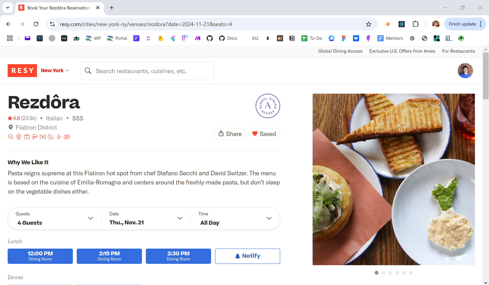
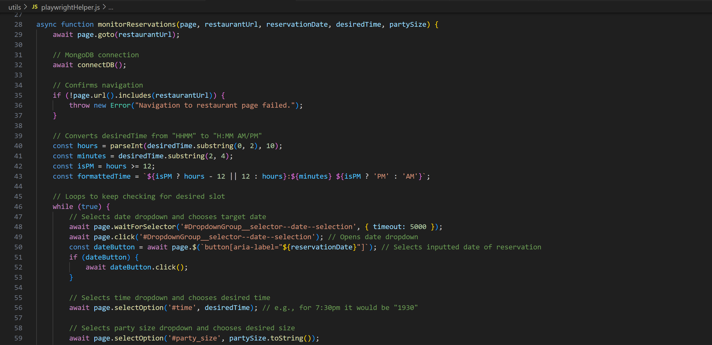

# Resy Bot Sniper

An automated reservation bot that secures table bookings on Resy based on user inputs: venue/date/time/party size. This project demonstrates automation in website navigation using Playwright and Node.js.

## Table of Contents
1. [Project Overview](#project-overview)
2. [Features](#features)
3. [Setup Instructions](#setup-instructions)
4. [Usage](#usage)
5. [Project Structure](#project-structure)

---

## Project Overview

This bot helps users get reservations on Resy by:
- Automatically navigating Resy's website.
- Selecting a desired venue, date, time, and party size.
- Sending an email notification via Sendgrid to confirm successful reservations.
- Storing reservation data in MongoDB for tracking.

Built with Playwright for automation, SendGrid for email notifications, and MongoDB for data storage.  


*Example restaurant where the bot will navigate and make a reservation*

## Features

- **Automated Reservation Selection**: chooses specified date, time, and party size on Resy.
- **Retry Mechanism**: continues attempting to make a reservation if no slots are available.
- **Email Notifications**: sends a confirmation email for successful reservations.
- **Data Storage**: saves reservation data in MongoDB for reference.

*Sendgrid emails are not fully necessary as Resy will send you a confirmation email. This was purely for me to practice email API integrations.

*MongoDB is used to store successful reservations, failed attempts, and user preferences over time. This can be analyzed for success rates, commonly booked time slots, and user behavior (it'll also log errors during execution to identify recurring performance bottlenecks and also make debugging easier). 
While this MongoDB integration isn't mandatory, it lays the groundwork for a scalable system with the potential for a user UI dashboard where more features are included: typing inputs without complex setup instructions, see insights on personal favorite restaurants and most probable availabilities, and manage preferences.

## Setup Instructions

### 1. **Clone the Repository**

```bash
git clone https://github.com/YOURUSERNAME/resybotsniper.git
cd resybotsniper
```
*use your github username in place of YOURUSERNAME*

### 2. **Install Dependencies**

```bash
npm install
```

### 3. **Set Up Environment Variables**

Create a .env file in the root of the project and add the following variables:
RESY_USERNAME: email address for your Resy account.
RESY_PASSWORD: password for your Resy account.
SENDGRID_API_KEY: API key for sending emails via SendGrid.
MONGO_URI: MongoDB connection string to store reservation data.
```
RESY_USERNAME = your_email@example.com
RESY_PASSWORD = your_resy_password
SENDGRID_API_KEY = your_sendgrid_api_key
MONGO_URI = mongodb_connection_string
```

## Usage

### Run the Bot

To start the bot and attempt a reservation, use the following command:

```bash
node index.js <restaurantUrl> <reservationDate> <reservationTime> <partySize>
```
Replace <restaurantUrl>, <reservationDate>, <reservationTime>, and <partySize> with your actual reservation details.

### Example:

```bash
node index.js "https://resy.com/cities/new-york-ny/venues/rezdora" "November 14, 2024" "1930" "2"
```
### Automated Emails & Data Storage

Once the bot successfully makes a reservation it will:
- Sends a confirmation email to your email using SendGrid
- Store the reservation details in MongoDB


## Project Structure

resybotsniper/  
├── utils/  
│   ├── playwrightHelper.js  
│   ├── sendNotification.js  
│   ├── dbHelper.js  
├── example.env  
├── .gitignore  
├── index.js  
├── package.json  
├── package-lock.json  
└── README.md  

| File / Folder             | Description                                         |
|---------------------------|-----------------------------------------------------|
| utils/                    | contains utility scripts                            |
| playwrightHelper.js       | handles Playwright automation and Resy login        |
| sendNotification.js       | manages email notifications via SendGrid            |
| dbHelper.js               | handles MongoDB database operations                 |
| example.env               | example environment variables                       |
| .gitignore                | specifies files to exclude from GitHub              |
| index.js                  | main entry point for the bot                        |
| package.json              | project metadata and dependencies                   |
| package-lock.json         | dependency tree lock file                           |
| README.md                 | project documentation                               |


*Code snippet for where the actual reservation takes place*